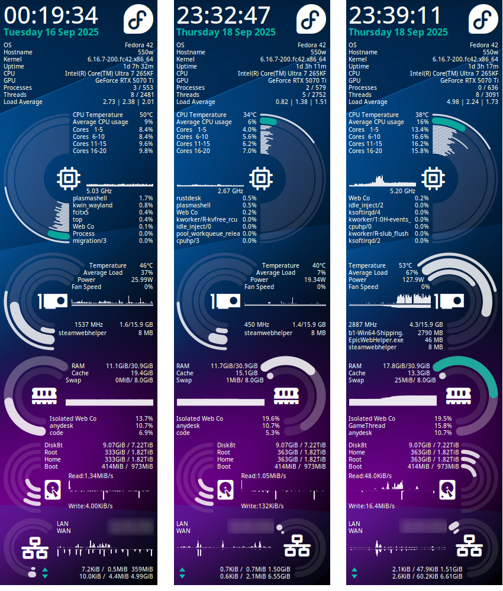
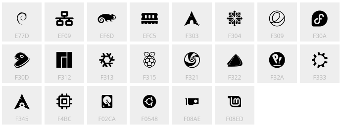

# jinli-conky

An elegant, pure lua conky configuration.



## Features

- Pure Lua configuration, not mixed conkyrc with lua.
- Elegant and modern design.
- Highly configurable, all configurations are in `jinli-config.lua`.
- Icons from Nerd Fonts.
- Auto detect network interfaces and disks.

## Install

Download or clone this repository. Ensure Conky is installed, then run the `start.sh` script:

```bash
./start.sh
```

The script creates `jinli-config.lua` from the example when it does not already exist, then starts Conky after a short delay. It also writes `conky-start.desktop` beside `start.sh`. To start it automatically at login:

```bash
mkdir -p ~/.config/autostart
cp conky-start.desktop ~/.config/autostart/
```

The desktop entry uses the repository's absolute path. If you move or rename the checkout, run `./start.sh --no-sleep` once and copy the regenerated entry again.

## Font

This conky configuration requires [Nerd Fonts](https://www.nerdfonts.com/) for icons. Or the icons will not display and it will display text instead.

Here I packed the icons used in this config into a custom font, which is based on the original `Symbols Nerd Font`. The font name is still `Symbols Nerd Font`, but with only the icons used in this config to reduce its size. The font file is in the `fonts` folder, named `subset-SymbolsNF.ttf`. You can double click to install it or you can install it by copying it to `~/.local/share/fonts/` or `/usr/share/fonts/`:

```bash
cp fonts/subset-SymbolsNF.ttf ~/.local/share/fonts/
fc-cache -fv
```

You can view what icons are included in the font I packed in [this website](https://wakamaifondue.com/). It includes basic letters, numbers, and following icons:



Or you can use the original `Symbols Nerd Font` if you prefer, which can be downloaded from [Nerd Fonts](https://www.nerdfonts.com/font-downloads).

## Configuration

All configurations are in `jinli-config.lua`. You can change the position of widgets, colors, fonts, etc.

The runtime normalizes the distribution name used for the OS icon by removing
optional surrounding single or double quotes. This is needed on systems such
as NixOS where `lsb_release -is` may return a quoted name such as `"NixOS"`.

### Global Configurations

- At the top of `jinli-config.lua`, set `local scaling = 'auto'` to calculate the scale from the detected screen height. The calculation respects the visible widget order and heights. Set `auto_scaling_bottom_margin` in `conky.jinli` to reserve space for a dock or taskbar (80 pixels by default). Set `scaling` to a number to use a fixed scale instead, such as `scaling = 2.0` for a 3840x2160 screen.

- In `conky.config` table, you can change the width and height.

- In `conky.config` table, you can change the update interval, location, transparency, gap to screen edge, etc.

### Widget Configurations

Each widget has its own configuration table in `conky.jinli.widgets`. You can show/hide widgets, change their position, and other specific settings. General settings for each widget include:

- `hide`: Set to `true` to hide the widget, `false` to show it.
- `pos`: A table specifying the x and y position of the widget, e.g., `pos = {x = 0, y = scale(100)}`.
- `gaugeLoc`: Set to `'left'`, `'right'`.

### GPU Widget Notes

The GPU widget now supports both NVIDIA and AMD on Linux.

- `gpuBackend`: `auto` (default), `nvidia`, or `amd`.
- `amdCard`: `auto` (default) or a specific card such as `card0`, `card1`.

In `auto` mode, it prefers `nvidia-smi` if available, otherwise it falls back to AMD sysfs (`/sys/class/drm/card*/device/...` and `hwmon`).

## Acknowledgements

- This configuration is adapted from [miracle-conky](https://github.com/tflori/miracle-conky).
- [Nerd Fonts](https://www.nerdfonts.com/) and "Symbols Nerd Font" for icons.
- [Transfonter](https://transfonter.org/) to pack the custom font.
- [Wakamai Fondue](https://wakamaifondue.com/) for viewing and creating custom fonts.

## License

This project is licensed under the MIT License. See the [LICENSE](./LICENSE) file for details.
